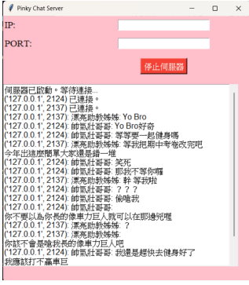
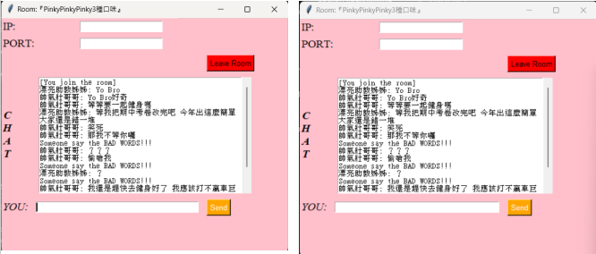

Socket Programming
===
主要功能：『多人聊天室Pinky Chat』
---
>• 可多人連線：使用multithreading讓主程序之下可以執行多人連線
>
>• 老少咸宜的聊天空間：過濾不雅字詞，例如：車力巨人 等等
>
>• 可捲動式訊息框：當接收新訊息時，會自動跳至最新訊息之頁面
>
>• 連接偵錯系統：可判斷當前連接錯誤原因，給予錯誤訊息。
>
>• 匿名聊天：可匿名進入聊天室（但server端還是能夠看到其ip）

粉紅色系GUI
---

聊天室範例（內容純屬虛構）
---

GUI
---
>• 界面皆由tkinter函式庫的button, window, Entry, Label, scrolledtext所組成。
>
>• 配色主打為可愛的粉紅色系，並搭配粗體、斜體標記重要label
>
>• 每個object使用grid來設定在視窗中的位置

Server端函式詳解
---
**• Start_server():**
建立主程序thread，target為run_server()，並讓update_display進入
每100毫秒更新一次卷軸式訊息串的循環

**• Update_display():**
更新訊息串，並設定有最新消息時，訊息視窗會跳至最新消息的
地方。

**• run_server() :**
建立TCP接口，並從輸入框中取得ip,port，開啟伺服器，等待用戶
連接，當有用戶成功連接，將此client接口放入clients陣列，並為其建
立一個thread，target為client_handler

**• Client_handler:**
• 接收用戶的訊息，並用broadcast(message)函數傳給其他用戶

**• broadcast():**
• 檢測用戶訊息是否有髒字，如果有就將“Someone say the BAD WORDS!!!” 傳給所有
用戶，正常的訊息則會正常傳送

**• Stop_server():**
當按下關閉伺服器按鈕會觸發，會先傳送訊息給用戶通知伺服器停止，才關閉伺服器
重要variable：
>• message_queue：儲存server接收與傳送的所有訊息
>• Clients[]: 儲存所有用戶的接口，以便在broadcast的時候可遍歷
>• Server_running: 此為決定server是否要繼續accept與處理用戶的布林值，在stop_server時
會設為false

Client端函式詳解
---
**• Connect_to_server():**
按下JOIN按鈕後，讀取entry中的ip與port，檢查是否符合輸
入規則後，建立TCP接口，連接對應server，如果連線失敗，將會跳
出錯誤原因之錯誤視窗，並讓用戶重新輸入；連接成功後，輸入名
字，畫面更新，轉換為聊天室界面，放大視窗，建立thread，
target為receive()

**• receive() :**
進入不斷等待接收server訊息的迴圈，將接收的訊息放入卷軸式文字框
內，同時try and except偵測是否有訊息錯誤等發生

**• send:**
• 在聊天界面中，按下send按鈕觸發，用來將用戶的訊息發送至server，成
功發送後將輸入框清空，另外，輸入框為空無法按下send

**• on_closing():**
• 在聊天界面中，按下leave按鈕觸發，離開聊天室並關閉視窗，此時server
會收到此address中斷連接的消息
